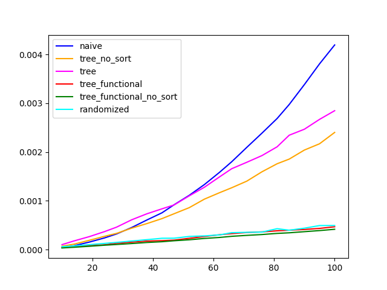
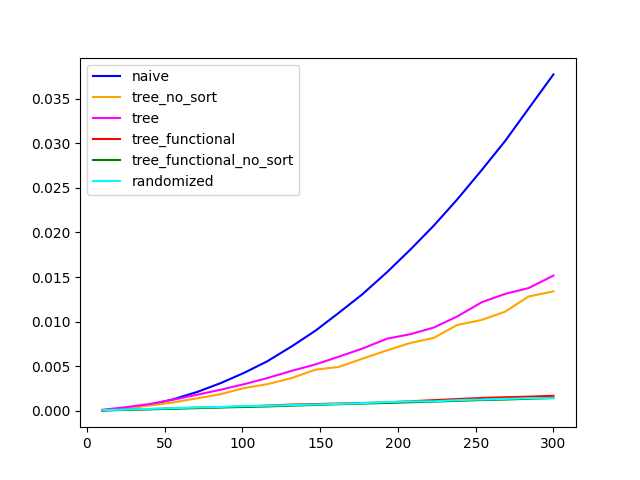
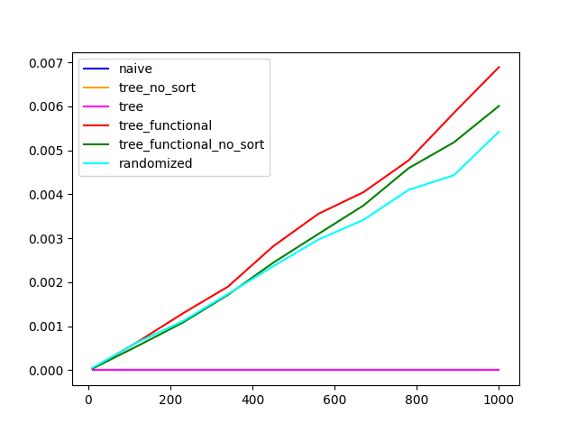
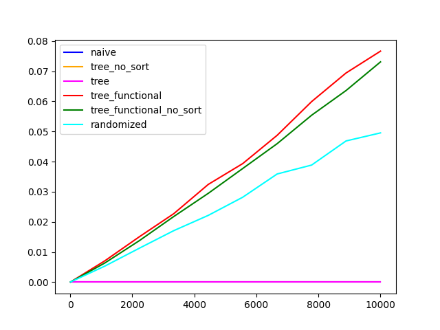
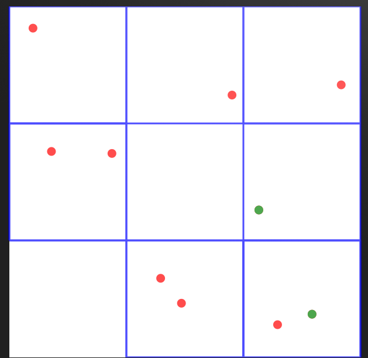
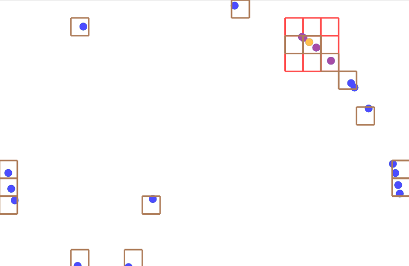

# Au correcteur

Ce readme fait office de rapport. Si vous lisez sur le pdf sachez que le readme.md contient des illustrations en plus.

L'equipe est constituee de Jules Doumeche (gr 6) et Quinten Bons (gr7).

On attire simplement votre attention sur 3 points:
- [lineaire (naive)](#lineaire) (Juste pour la forme).
- [Arbre median](#arbre-median) (Moins efficace que Arbre fonctionnel, qui est la vraie solution kd-tree, mais on aimerait vous montrer une solution inefficace en python qu'on a essayé. Un échec peut être digne d'attention.)
- [Grille](#grille) (Simplement pour vous montrer qu'on sait bien lire un pdf en ligne...)

# Sommaire
- [performances](#performances)
- [Structure](#structure)
- [Solutions](#solutions)
    - [lineaire (naive)](#lineaire)
    - [Arbre aleatoire](#arbre-aleatoire)
    - [Arbre median](#arbre-median)
    - [Arbre fonctionnel](#arbre-fonctionnel)
    - [Grille](#grille)
- [Remerciements](#remerciements)

# Performances

Il suffit de regarder les courbes: tres vite (n>300), la solution grille devient la meilleure. on devine aussi les complexites sur les courbes, mais une analyse est disponible plus loin.

Note: au dela de 300 points j'ai elimine les cas les moins performants.

Note2: naive est en fait un peu meilleure, mais on juge que ca ne vaut quand meme pas la peinde de refaire le jeu de tests.

# Structure

Le projet est ecrit en anglais, mais les commentaires sont en francais.
Les sous dossiers de student/ ont tous un script solution.py qui contient une fonction get_closest(points) qui retourne un couple de points plus proches voisins. 
Il arrive que les structures utilisees soint programmees dans des fichiers autres que solution.py (comme tree.py).

Voici la structure de git:

- exemple_x.pts -> Exemples de nuages de points
- hello.py -> Exemple de debug (import initial)
- main.py -> Programme principal qui lance la solution la plus efficace par defaut
- test.py -> Programme de tests (il faut lire un peu pour comprendre)
- time_complexity.py -> Tests de performances (affichage grace a pyplot)
- geo/ -> Modules geometriques
    - point.py
    - quadrant.py
    - segment.py
    - tycat.py
- student/ -> Coeur du travail des eleves
    - traceur.py -> Traceur (merci au prof de BPI qui a cree ceci)
    - utils.py -> Utilitaires utilises dans les autres scripts
    - naive/ -> [lineaire (naive)](#lineaire)
    - tree_no_sort/ -> [Arbre aleatoire](#arbre-aleatoire)
    - tree/ -> [Arbre median](#arbre-median) Un echec interessant
    - tree_functional -> [Arbre fonctionnel](#arbre-fonctionnel)
    - tree_functional_no_sort -> Arbre fonctionnel sans tri pour trouver la mediane
    - randomized/ -> [Grille](#grille)

# Solutions

-- --

## lineaire

### Explication

Solution naive consistant a trouver pour chaque point le voisin le plus proche en calculant la distance de chaque voisin, avant de chercher le minimum de distance.

### Complexite | cas quelconque: O(n2) 

Il s'agit d'une double boucle: O(n) dans O(n).

-- --

## Arbre aleatoire

### Explication

Insere tous les points un a un dans un arbre k-d avec k=1 d=2. Les points sont inseres dans un ordre aleatoire pour eviter d'etre influence par l'ordre des points
(au cas ou ils seraient tries par exemple, ce qui menerait a un cas tres peu performant).

Dans le meilleur des cas, l'insertion du i-eme point permet de trouver son voisin le plus proche en O(ln i). 
Dans le pire des cas, il faudra passer par tous les points, ce qui reste mieux que la solution lineaire en performance (equivalent en complexite)

Une amelioration de cette solution, si on ne fait pas confiance au dieu de la chance, serait d'inserer dans l'ordre les points mediants de chaque hyperplan ceci mene a un kd-tree "plus parfait".
(Voir la solution [Arbre median](#arbre-median))

### Complexite | meilleur cas: O(n ln(n)) | pire cas: O(n2) | cas moyen: O(n lnan) 

Le meilleur des cas est atteint quand l'arbre est parfait, et qu'il n'y a jamais d'intersection entre la boule de proximite et l'hyperplan oppose. Voir la solution k-d dans le meilleur des cas.

Le pire des cas est atteint quand l'arbre est un peigne droit ou gauche, et que la racine est toujours le point le plus proche de chacune des feuilles.
L'insertion du i-eme point se fait en O(i), il suffit donc de faire la somme des i pour i allant de 2 a n. (Note: c'est un peu mieux que la solution naive quand meme)

Il reste assez raisonable de penser que l'on n'aura pas souvent besoin de gerer le cas d'intersection en inserant le i-eme point.
On pourrait faire un long calcul probabiliste pour essayer de montrer qu'approcher ce nombre par un O(i) est grandement exagere, mais cela ne me semble pas tres interessant.
On peut donc faire une supposition tres bancale que ce nombre est en O(ln i), ET que ces occurrences se prononcent loin de la racine (sur les C dernieres branches, avec C constant... ou en O(ln i) si vous voulez).
Ce qui mene avec des calculs assez simples au fait que l'insertion et la recherche du i-eme point se fait en moyenne en O(ln i) (ou en O(lna i).

Ainsi le cas moyen est quand meme quasi lineaire. Et si vous n'arrivez pas a avaler l'hypothese bancale, on sera du moins en O(n lna(n)). La page wikipedia anglaise qui ressemble le plus a notre implementation dit pour l'insertion d'un point "The performance of this algorithm is nearer to logarithmic time than linear time".

-- --

## Arbre median

### Explication

Note: ceci est un algorithme tres peu performant, car on l'a pas concu pour cela (sinon on aurait fait du C)

Idem que l'arbre aleatoire, mais selectionne le meilleur point a inserer a chaque fois. La fonction de tri ne sera executee qu'une seule fois, au debut de l'algorithme.
Ce tri est fait pour les deux axes, en O(n ln n). Nous utilisons ici le qsort de python, mais un algorithme en diviser pour reigner pourrait aussi marcher.

Une petite "amelioration" (qui au final en python n'en est pas une) de la fonction get_closest a aussi ete apportee.

Le dessin le montre bien: les ensembles de points B et A seront de toute facon trop loin de P2 pour etre un meilleur voisin. Autant ne pas les regarder du tout (cela couterait une simple projection). Au final le fait de projeter 1 fois par noeud coute plus cher que de quand meme verifier tous les points de A et B dans le cas moyen. Mais c'etait quand meme une experience interessante.

### En pratique

Il s'avere que 1/4 des noeuds sont esquives par la petite amelioration. Mais la courbe de performance monte a notre grand etonnement.
Il est aussi a noter qu'en python (peut etre pas en C) l'arbre aleatoire etait plus efficace sur des points generes aleatoirement.

### Complexite | cas moyen: O(n ln(n))

Tri en O(n ln n).

On se retrouve ensuite dans le meilleur des cas de l'arbre aleatoire, a quelques o(ln n) pres...
Sans trop rentrer dans les details, on est en O(n ln n) si notre algorithme de recherche d'intersection s'effectue assez rarement.

Ainsi le total se fait en temps proche de O(n ln n).

-- --

## Arbre fonctionnel

Il s'agit la de la bonne implementation des kd tree. Il suffit de taper "closest pair algorithm" sur <strike>google</strike> duckduckgo.
C'est un algorithme tres simple, mais interessant en analyse, car la complexite est quasiment incalculable si on ne fait pas quelques hypotheses douteuses.

### Complexite | cas moyen: O(n ln(n))

Proche de arbre median en pratique. C'est en <bold>performance</bold> que l'on gagne le plus (x20), et non en complexite.

Si on en croit wikipedia, on est meme plus de l'ordre du O(n ln(ln n)). Le probleme est que cela depend beaucoup du nuage de points: si les coefficients sont entiers par exemple cela prendra bien plus longtemps (points qui ont la meme ordonnee)

-- --

## Grille

### Explication

Il s'agit ici de la meilleure solution selon nos amis developpeurs de stack overflow et wikipedia. Il suffit de marquer "Closest Pair Randomized algorithm" sur <strike>google</strike> duckduckgo.

Nous avons eu l'idee seuls avant de voir l'algorithme en ligne, mais on confesse que le courage de l'implementer en python vient du fait que l'on a eu confirmation que l'algorithme avait une bonne complexite en ligne.

- Etape 1

On obtient une premiere approximation de dmin en prenant n couples aleatoires (parmi n!) avec remise.

Cette etape n'est pas a negliger: il faut etre en O(n) donc on ne teste que n couples, quitte a avoir peut etre une tres mauvaise approximation. L'ideal c'est d'avoir dmin du premier coup.

Par exemple ici, on a trouve les deux points verts comme les meilleurs voisins. C'est faux, mais tant pis, on peut deja utiliser cette distance pour faire une grille.

- Etape 2

Pour chaque point (donc O(n)) on les ajoute a la grille, en utilisant un hachage de tuples (un XOR aurait pu marcher, mais cela implique une symetrie sur les coordonnees).

Avant d'ajouter le point a la grille, on verifie aussi sa distance avec tous les points dans les voisins de Moore de sa grille, et on garde la plus petite distance en fin d'algorithme.

Par exemple ici, le point jaune est celui qu'un insere. Les voisins de Moore vides sont en rouge. Les points qui sont potentiellement de meilleurs voisins que l'approximation de l'etape 1 son dans les voisins de Moore (points violets).

### Complexite | cas moyen: O(n)

L'algorithme ne fait que des "boucles" simples a travers les points.

### En partique

L'algorithme est extremement sensible a la premiere approximation. Dans un nuage de points aleatoire, on ne risque pas trop d'avoir dapprox >> dmin, mais si c'est le cas, on se retrouve a faire l'algo naif, en pire (car on fait 2 fois tous les couples).

# Remerciements

Nous vous remercions de votre travail, ce sujet etait interessant, meme si classique. Nous en avons tire quelques bonnes habitudes, et le travail a deux etait quelque chose d'assez nouveau pour l'un d'entre nous (Quinten).